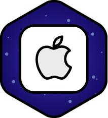

<!DOCKTYPE html>
<html lang="ru">
  <head>
    <meta charset="utf-8">
    <title>Gagarin It-school</title>  
  </head>
  <body>
    <style="background-image: url"(../img/photo_webinar2.jpg)>
    <header class="site-header">
      

        <figure class="logo">
          
        </figure>
        <nav class="main-navigation">
          <ul>
            <li>
              <a href="#">Курсы</a>
            </li>
            <li>
              <a href="#">О нас</a>
            </li>
            <li>
              <a href="#">Вебинары</a>
            </li>
            <li>
              <a href="#">Отзывы</a>
            </li>
            <li>
              <a href="#">Блог</a>
            </li>
            <li>
              <a href="#">Контакты</a>
            </li>
          </ul>       
        </nav>
        

          <a class="consultation" href="#">Бесплатная консультация</a>
        

      

    </header>  
    <main class="container">
      <style="background-image: url"(../img/photo_webinar2.jpg)>
        
 
          
        
 
          <h1>Самое доступное IT-образование</h1>
            <h2>Для людей любого возраста и с любой базой знаний</h2>
        

          <a class="consultation" href="#">Бесплатная консультация</a>
        
 
        
         
          
          
        
     
        

          <h2>Наши направления</h2>
           
             
Теория дизайна

           
             
Motion design

           
             
Android

           
             
IOS

           
             
Frontend

           
             
Javascript

           
             
Wordpress

           
             
PHP

         

       

         
 
          
            <h2>О нас</h2>
              
Этот мир стремителен и постоянно толкает нас к новым свершениям и открытиям. Великие спортсмены, ученые и бизнесмены стали известными только потому, что застой для них 
                хуже провала и неудач. Нам так же невыносимо топтаться на месте и мы выходим за рамки одного университета, за рамки одного города.

              
Юрий Гагарин изменил наш мир, когда став первым, кто вышел в открытый космос. Наши амбиции близки по масштабам. Своим проектом мы хотим изменить представление об IT-
                образовании и сделать первую, по-настоящему доступную IT-школу для всех желающих.  
                Назвать этот проект мы решили именем человека с большой буквы, летчика-космонавта - Юрия Алексеевича Гагарина.

              
Вчера IT-школа НГУ, сегодня GAGARIN IT-shcool. Поехали!

     

     

       <h3 class="specification-title">Почему мы</h3> 
       
   
         
           
Система менторства

           
Менторы - практикующие Middle/Junior специалисты, выступающие наставниками для 3х студентов. Менторы ассистируют преподавателю и направляют 
             вас в обучении, помогают и отвечают на вопросы.

       

       
  
         
           
Демократические цены

           
Наша цель - предоставить IT образование, которое улучшает жизнь людей и меняет общество. Помочь каждому раскрыть свой потенциал в IT 
             индустрии за вменяемую цену.

       

       

         
           
Бизнес образование

           
Опытные бизнесмены покажут на личном примере, как продавать свои услуги на рынке труда. Бизнес-тренера помогут открыть свою студию и быть 
             конкурентоспособным в сфере IT

       

    </main>
    

      

        
940

        
Часов лекций

      

      

        
146

        
Студентов прошли курсы

      

      

        
15

        
Практикующих преподавателей

      

      

        
90

        
Реальных кейсов

      
     
    

    <section class="webinar">
      

        <h3 class="webinar-title">Вебинары</h3>
        

          
           
            
Как стать востребованным фрилансером

            <time datetime="2016-10-11">11.10.2016</time>
        
 
        

          
            
Как открыть веб-студию

            <time datetime="2016-10-29">29.10.2016</time>
        
 
        

          
            
Продвижение бизнеса в Instagram

            <time datetime="2016-11-04">04.11.2016</time>
        
 
        

          
            
Таргетинг во Вконтакте

            <time datetime="2016-11-13">13.11.2016</time>
        
 
      </section>
      

        <h3 class="reviews-title">Отзывы</h3>
          <figure class="image-quotes">
            
          </figure>
        

          
Очень крутой и познавательный курс. Спасибо за советы и обучение. Этот курс дает отличный старт для дальнейшего обучения и продвижения. Было весело, дружно и поучительно!
          

          
Алексей Бачурин

          
UX Design
 
                    
        
 
        
         
          
            
            
            
                      
          
        

        

          
Лучшие студенты получают реальные заказы

          
Во время обучения студенты берут заказы от наших партнеров и нарабатывают первые кейсы. Трудоустройство выпускников - наша главная цель. Мы не даем 
            теорию, а работаем над "живыми" проектами.

        

          <a class="course" href="#">Подобрать курс</a>
        

      
      
      

        <h3 class="blog-title">Блог</h3>
        

          <time datetime="2016-06-12">12 июня</time>
             
              
Amazing Image Post
     
              
By admin | 2 comment

        

        

          <time datetime="2016-07-18">18 июля</time>
             
              
Amazing Blog Post
     
              
By admin | 2 comment
        
        

        

          <time datetime="2016-07-30">30 июля</time>
             
              
Amazing Blog Post
     
              
By admin | 2 comment
        
        
      
        

          <time datetime="2016-08-20">20 августа</time>
             
              
Amazing Blog Post
     
              
By admin | 2 comment
        
        
  
      
 
      

        <h3 class="partners-title">Наши партнёры</h3>   
        
        
        
      
 
      

        <h3 class="contact-title">Контакты</h3>
        

          
        

          

            
+3 8 095 05 35 007

            
Sidpk2009

            
sidpk2010@mail.ru

          
      
        
 
        

          
<b>Остались вопросы?</b> 
          Напишите нам, мы ответим на все ваши вопросы
 
          <form class="appointment-form" action="#" method="post">
            <input type="text" name="name" value="" placeholder="Имя">
            <input type="text" name="mail" value="" placeholder="Email">
            <input type="tel" name="phone" value="" placeholder="Телефон">
            <input type="text" name="message" value="" placeholder="Сообщение">
            <button class="btn" type="submit">Получить консультацию</button>
          </form>
        

      

      <footer class="main-footer"
        

          
          
Самое доступное IT-образование для людей любого возраста и с любой базой знаний

            <b>Телефон:</b> +3 8 095 05 35 007 
            <b>Skype:</b> Sidpk2009  
            <b>Email:</b> sidpk2010@mail.ru

        

        

          <h3 class="footer-news-title">Последние новости</h3>
          <ul class="footer-news-preview">
            <li>
              
              
Процесс создания А/В теста

              
Что такое А/В тестирование? Нет, это не только простое сравнение...

              <time datetime="2016-08-23">23 Августа, 2016</time>
            </li>
            <li>
              
              
Поисковые системы

              
Поисковая машина сегодня - это сложнейшая структура, состоящая...

              <time datetime="2016-08-22">22 Августа, 2016</time>
            </li>
            <li>
              
              
Ищем наставников

              
Не за горами новые курсы и новые студенты. Чтобы...

              <time datetime="2016-08-21">21 Августа, 2016</time>
            </li> 
          </ul>             
        

        

          <h3 class="footer-subs-title">Подпишитесь на наши новости</h3>
          
Оставайтесь в курсе трендов IT рынка, а также всех новостей GAGARin IT-school</>
        <form class="footer-subs-mail" action="#" method="post">
          <input type="text" name="mail" value="" placeholder="Ваш e-mail">
          <button class="btn-subs" type="submit">GO</button>
        </form>
        

        

          <h3 class="footer-social-title">Мы в социальных сетях</h3>
          
          
          
          
          
          
        

      

    </footer>
    <footer class="footer-copyright">
      
Copyright 2015 GAGARIN IT-school | Все права защищены 

    </footer>
  </body>
</html>
