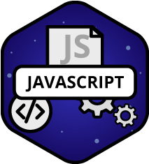

<!DOCKTYPE html>
<html lang="ru">
  <head>
    <meta charset="utf-8">
    <title>Gagarin It-school</title>  
  </head>
  <body style="background-image: url"(../img/photo_webinar2.jpg)>
  </body>
  <body>
    <header class="site-header">
      

        

          
        

        <nav class="main-navigation">
          <ul>
            <li>
              <a href="#">Курсы</a>
            </li>
            <li>
            <a href="#">О нас</a>
            </li>
            <li>
              <a href="#">Вебинары</a>
            </li>
            <li>
              <a href="#">Отзывы</a>
            </li>
            <li>
              <a href="#">Блог</a>
            </li>
            <li>
              <a href="#">Контакты</a>
            </li>
          </ul>       
        </nav>
        

          <a class="consultation" href="#">Бесплатная консультация</a>
        

      

    </header>  
    <main class="container">
      <body style="background-image: url"(../img/photo_webinar2.jpg)>        
      </body>
      
 
        
      
 
      <h1>Самое доступное IT-образование</h1>
      <h2>Для людей любого возраста и с любой базой знаний</h2>
      

          <a class="consultation" href="#">Бесплатная консультация</a>
      
 
      
         
        
        
      
     
     

    </main>
       <h2>Наши направления</h2>
         
           
Теория дизайна

         
           
Motion design

         
           
Android

         
           
IOS

         
           
Frontend

         
           
Javascript

         
           
Wordpress

         
           
PHP

     

     

        
 
          
            <h2>О нас</h2>
              
Этот мир стремителен и постоянно толкает нас к новым свершениям и открытиям. Великие спортсмены, ученые и бизнесмены стали известными только потому, что застой для них хуже провала и неудач. Нам так же невыносимо топтаться на месте и мы выходим за рамки одного университета, за рамки одного города.

              
Юрий Гагарин изменил наш мир, когда став первым, кто вышел в открытый космос. Наши амбиции близки по масштабам. Своим проектом мы хотим изменить представление об IT-образовании и сделать первую, по-настоящему доступную IT-школу для всех желающих.  
Назвать этот проект мы решили именем человека с большой буквы, летчика-космонавта - Юрия Алексеевича Гагарина.

              
Вчера IT-школа НГУ, сегодня GAGARIN IT-shcool. Поехали!

     

  </body>
</html>
